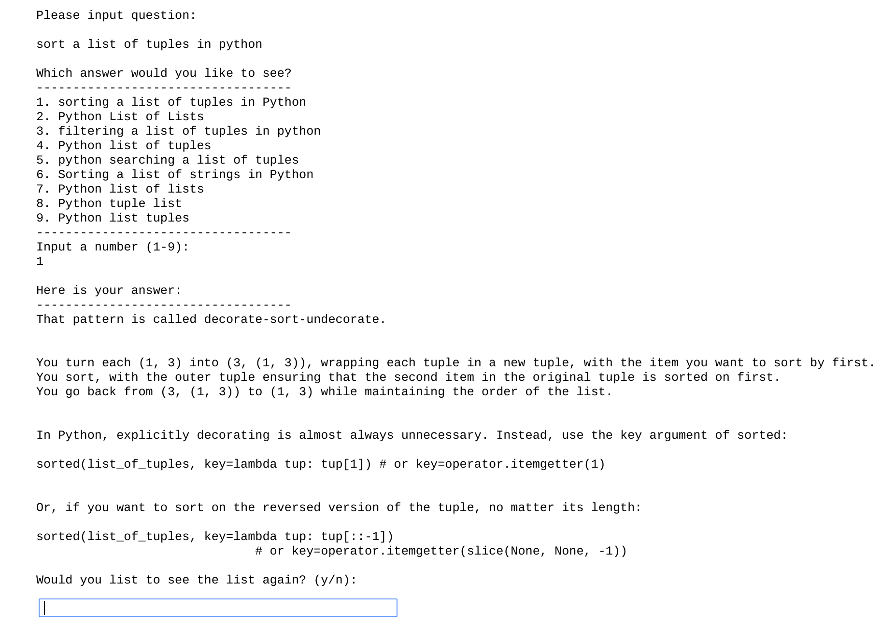

# Stackbot

Stackbot is a Python question/answer terminal assistant. The goal was to create a tool which could use a database of questions and use NLP to read in the user's input and relay those similar questions and answers from stack overflow to the user. 

The data was pulled from Google Big Query's public stackoverflow dataset and I have attached the queries I used to develop the datasets. I narrowed it down to just Python related questions to save space locally and time while training my model. Whittling it down to just Python questions reduced the overall storage footprint from ~19.0gb to ~1.7gb. The cleaned-datasets and models which I trained can be downloaded [here](https://drive.google.com/open?id=19JJ7XgkrGoFU80n0zLHwv-VOKniZJhFY).

To use Stackbot simply download everything locally and install the dependencies; I recommend using Jupyter Notebook for ease of use. Make sure you using **Gensim 3.5.0**. If you are using Gensim 3.4.0 or lower, you will experience much worse predictions as there is a problem with Gensim 3.4.0. 

Here is a screenshot example of Stackbot in action. It can be asked anything Python related and you can ask as many questions as you want in one session. 

